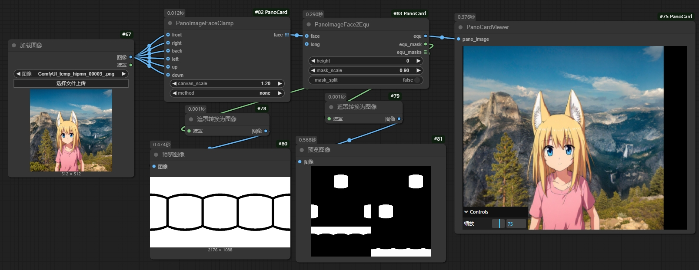
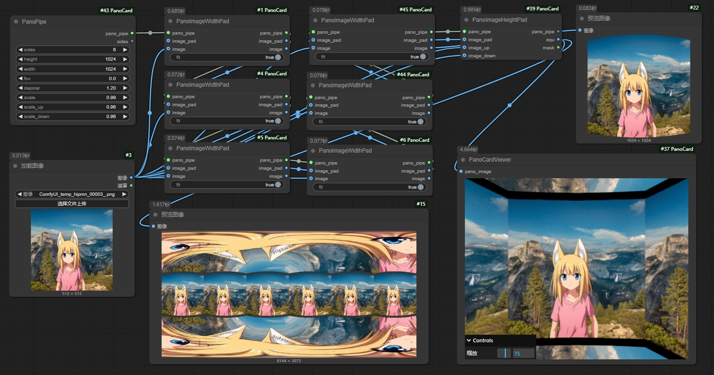
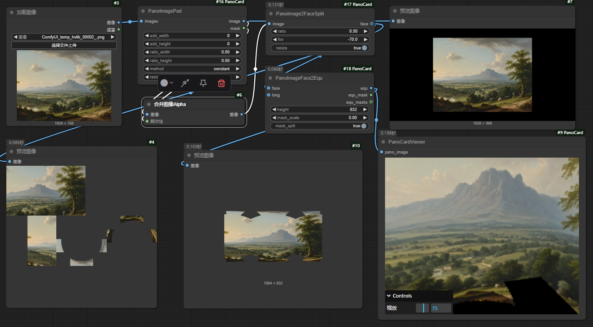
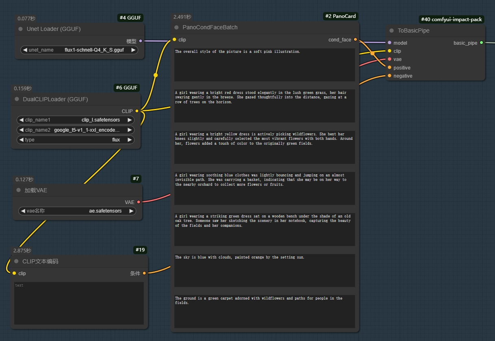
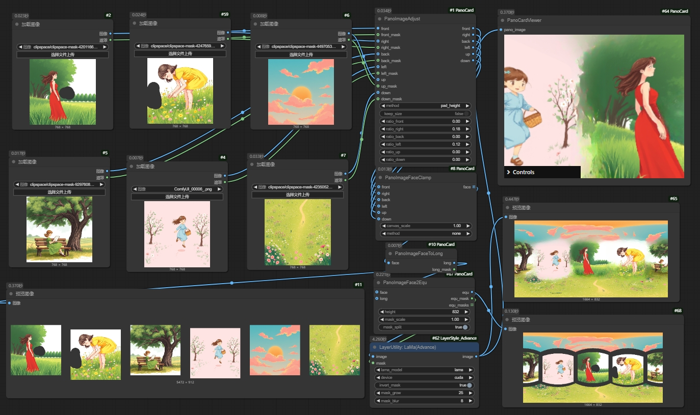
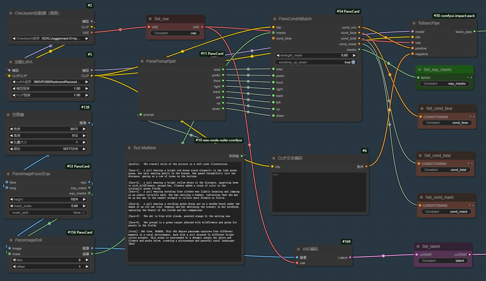

# ComfyUI-PanoCard
A plugin application that utilizes ComfyUI to generate 360-degree panoramic images. It primarily works by converting between flat images and equidistant cylindrical projections, stretching flat images into a curved format, and setting regional conditions, while harnessing the power of large models to produce 360-degree panoramic views.

## Features
- 支持360度全景图和平面图像的相互转换 Support the mutual conversion between 360 degree panoramic images and flat images

- 支持平面图片进行圆弧拉伸和极轴变换 Support arc stretching and polar axis transformation for flat images

- 将平面图像按照全景的方式分割为6个面 Split flat images into 6 faces according to the panoramic way
 

- 编写6个面的提示词一次性生成6个面 Write 6 prompts to generate 6 faces at once
 

- 组合6张图片通过手动调整来生成一张360全景图 Combine 6 images to generate a 360 panoramic image by manually adjusting
 

- 利用区域提示词生成360度全景图 Utilize regional prompts to generate 360 degree panoramic images
 

## 注意事项
- 需要安装ComfyUI-Impact-Pack来进行区域采样 https://github.com/ltdrdata/ComfyUI-Impact-Pack

## 反馈交流
- 如果有使用上的问题、建议、Bug等，可以通过抖音(抖音号：ycmiyesic)，或者加我V：beliveWeC
- 如果需要商业化展示你生成的全景图可以联系我，我能提供全景后台

## 参考链接
- Pano查看器参考：https://github.com/gokayfem/ComfyUI-Dream-Interpreter
- 图像基础变换参考ComfyUI-ALLOR: https://github.com/Nourepide/ComfyUI-Allor

